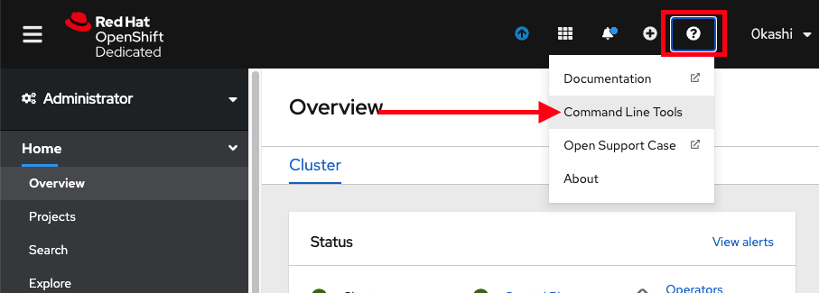

## Prerequisites

#### 1. OC Command Line Interface
You will need to [download and install](https://docs.openshift.com/dedicated/cli_reference/get_started_cli.html#installing-the-cli) the latest OpenShift CLI (oc).  

> **NOTE:** You can access the command line tools page by clicking on the *Questionmark > Command Line Tools*:

**Why use `oc` over `kubectl`** 
Being Kubernetes, one can definitely use `kubectl` with their OpenShift cluster.  `oc` is specific to OpenShift in that it includes the standard set of features from `kubectl` plus additional support for OpenShift functionality.  See [Usage of oc and kubectl commands](https://docs.openshift.com/dedicated/4/cli_reference/openshift_cli/usage-oc-kubectl.html) for more details.

#### 2. A GitHub Account
You will need your own GitHub account for some portions of this lab.  If you do not already have a GitHub account please visit <https://github.com/join> to create your account.

#### 3. Install Git
Install Git on your workstation.  See the official [Git documentation](https://git-scm.com/book/en/v2/Getting-Started-Installing-Git) for instructions per your workstation’s operating system.

#### 4. An AWS Account
If you are using AWS organizations and you need to have a Service Control Policy (SCP) applied to the AWS account you plan to use, see the [Red Hat Requirements for Customer Cloud Subscriptions](https://www.openshift.com/dedicated/ccs#scp) for details on the minimum required SCP.

You will need the following pieces of information from your account:

- AWS Access Key ID
- AWS Secret Access Key

#### 5. A Red Hat Account
If you do not already have a Red Hat account, [follow this link to create one](https://cloud.redhat.com/). Accept the required terms and conditions. Then, check your email for a verification link.

#### 4. Amazon Red Hat OpenShift Cluster
You will need an AMRO cluster in order to execute the lab with.  If you do not have one please see the [Creating an Amazon Red Hat OpenShift Cluster](1b-create_amro.md) section.
