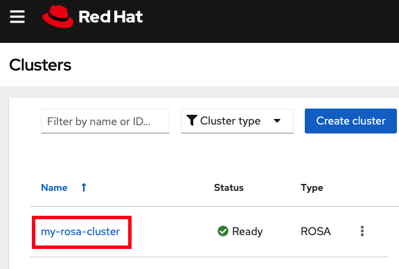
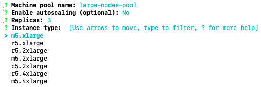

## Managing Worker Nodes

When using your cluster there may be times when you need to change aspects of your worker nodes. Things like scaling, changing the type, adding labels or taints to name a few. Most of these things are done through the use of machine pools in ROSA. Think of a machine pool as a “template” for the kinds of machines that make up the worker nodes of your cluster. A machine pool allows users to manage many machines as a single entity.

#### Scaling worker nodes

1. To scale the number of worker nodes we need to edit the machine pool they belong to. The default machine pool is called “default” which is created with every cluster.
1. We should see the “default” pool that is created with each cluster.

    `rosa list machinepools -c <cluster-name>`

    You will see a response like:
    

1. To scale this out to 3 nodes run

    `rosa edit machinepool -c <cluster-name> --replicas <number-worker-nodes> <machinepool-name>`

    For example:
    `rosa edit machinepool -c my-cluster --replicas 3 default`

1. Run `rosa describe cluster -c <cluster-name>` to see that it has taken effect.  You will see a response showing 3 nodes:

    

1. One can also confirm this by accessing OCM (<https://cloud.redhat.com/openshift>) and selecting the cluster

    

1. On the overview tab, scroll down to the middle section under details you will see Compute listing "3/3".

    

#### Adding node labels

1. Sometimes it is beneficial to add a node label(s). One use case is to target certain workloads to specific nodes. Let’s say we want to run our database on specific nodes. We can create a new machine pool to add the node labels to the worker nodes created by it.
1. Run the following command to create a new machine pool with node labels

    `rosa create machinepool --cluster=<cluster-name> --name=<mp-name> --replicas=<number-nodes> --labels=’<key=pair>’`

    For example:

        $ rosa create machinepool --cluster=ok-rosa-012321 --name=db-nodes-mp --replicas=2 --labels='app=db','tier=backend'
        I: Machine pool 'db-nodes-mp' created successfully on cluster 'ok-rosa-012321'
        
        This will create us an additional 2 nodes that we can manage as one unit and also assign them the labels shown.  

1. Now run `rosa list machinepools -c <cluster-name>` you will see the new machine pool created along with the labels we gave.

	

#### Using different node types

1. You can also mix different machine types for the worker nodes with new machine pools. You cannot change the node type of a machine pool once created, but we can create a new machine pool with the larger nodes by adding the `--instance-type` flag.
1. If we take the use case above but instead wanted to have a different node type when creating it, we would have ran

    `rosa create machinepool --cluster=<cluster-name> --name=<mp-name> --replicas=<number-nodes> --labels=’<key=pair>’ --instance-type=<type>`

	For example:
	
    `rosa create machinepool --cluster=ok-rosa-012321 --name=db-nodes-large-mp --replicas=2 --labels='app=db','tier=backend' --instance-type=m5.2xlarge`

1. If you’d like to see all the [instance types available](https://www.openshift.com/products/dedicated/service-definition#compute-types), or to make the decisions step-by-step, then use the `--interactive` flag

    `rosa create machinepool -c <cluster-name> --interactive`

    

1. List the machine pools to see the new larger instance type

    

*[ROSA]: Red Hat OpenShift Service on AWS
*[IdP]: Identity Provider
*[OCM]: OpenShift Cluster Manager